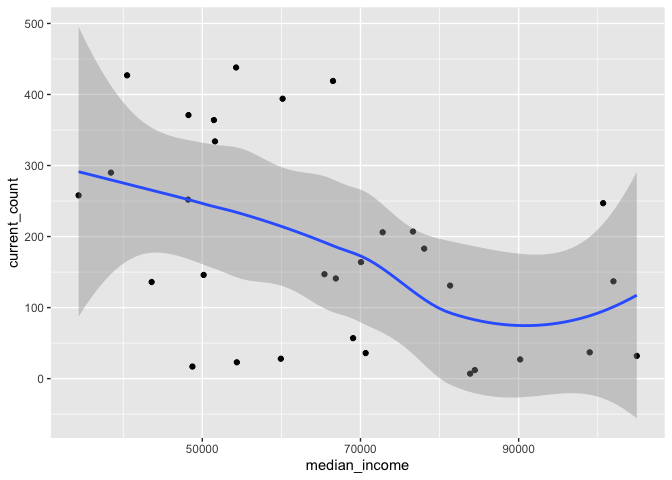

DeKalb County by Zipcode
================

``` r
#Load required libraries

library(tidyverse)
```

    ## ── Attaching packages ─────────────────────────────────────────────────────────────────────────────── tidyverse 1.3.0 ──

    ## ✓ ggplot2 3.3.1     ✓ purrr   0.3.4
    ## ✓ tibble  3.0.1     ✓ dplyr   1.0.0
    ## ✓ tidyr   1.1.0     ✓ stringr 1.4.0
    ## ✓ readr   1.3.1     ✓ forcats 0.5.0

    ## ── Conflicts ────────────────────────────────────────────────────────────────────────────────── tidyverse_conflicts() ──
    ## x dplyr::filter() masks stats::filter()
    ## x dplyr::lag()    masks stats::lag()

``` r
#Import and tidy data from DeKalb County Board of Health

dekalb <- read_lines("Dekalb.txt", skip_empty_rows = TRUE)
dekalb <- dekalb[dekalb != "\t"]
dekalb <- dekalb[6:(length(dekalb))]
dekalb <- matrix(dekalb, ncol = 5, byrow = TRUE) %>%
  as_tibble() %>%
  select(V1, V3) %>%
  rename(ZIP = V1,
         current_count = V3,)
```

    ## Warning: The `x` argument of `as_tibble.matrix()` must have column names if `.name_repair` is omitted as of tibble 2.0.0.
    ## Using compatibility `.name_repair`.
    ## This warning is displayed once every 8 hours.
    ## Call `lifecycle::last_warnings()` to see where this warning was generated.

``` r
#Import data from US Census American Community Survey 2018 5-year estimate

zcta <-
  read_csv("ACSST5Y2018.S1901_data_with_overlays_2020-07-04T190723.csv",
           skip = 1) %>%
  mutate(ZIP = str_extract(`Geographic Area Name`,
                           ".....$")) %>%
  select(ZIP, `Estimate!!Households!!Median income (dollars)`)
```

    ## Parsed with column specification:
    ## cols(
    ##   .default = col_character(),
    ##   `Estimate!!Households!!Total` = col_double(),
    ##   `Margin of Error!!Households MOE!!Total` = col_double(),
    ##   `Estimate!!Families!!Total` = col_double(),
    ##   `Margin of Error!!Families MOE!!Total` = col_double(),
    ##   `Estimate!!Married-couple families!!Total` = col_double(),
    ##   `Margin of Error!!Married-couple families MOE!!Total` = col_double(),
    ##   `Estimate!!Nonfamily households!!Total` = col_double(),
    ##   `Margin of Error!!Nonfamily households MOE!!Total` = col_double()
    ## )

    ## See spec(...) for full column specifications.

    ## Warning: 280 parsing failures.
    ##   row                                      col expected actual                                                         file
    ## 29477 Estimate!!Households!!Total              a double   null 'ACSST5Y2018.S1901_data_with_overlays_2020-07-04T190723.csv'
    ## 29477 Margin of Error!!Households MOE!!Total   a double   null 'ACSST5Y2018.S1901_data_with_overlays_2020-07-04T190723.csv'
    ## 29477 Estimate!!Families!!Total                a double   null 'ACSST5Y2018.S1901_data_with_overlays_2020-07-04T190723.csv'
    ## 29477 Margin of Error!!Families MOE!!Total     a double   null 'ACSST5Y2018.S1901_data_with_overlays_2020-07-04T190723.csv'
    ## 29477 Estimate!!Married-couple families!!Total a double   null 'ACSST5Y2018.S1901_data_with_overlays_2020-07-04T190723.csv'
    ## ..... ........................................ ........ ...... ............................................................
    ## See problems(...) for more details.

``` r
#Join ACS data with local COVID-19 data and specify column types

dekalb <- dekalb %>%
  inner_join(zcta) %>%
  mutate(
    current_count = as.numeric(current_count),
    median_income = as.numeric(`Estimate!!Households!!Median income (dollars)`)
  ) %>%
  select(!(`Estimate!!Households!!Median income (dollars)`))
```

    ## Joining, by = "ZIP"

``` r
#Now let's make a plot to see if there is a correlation between income and disease

ggplot(data = dekalb,
       mapping = aes(median_income, current_count)) +
  geom_point() +
  geom_smooth()
```

    ## `geom_smooth()` using method = 'loess' and formula 'y ~ x'

<!-- -->

``` r
#It looks like there's a correlation. Let's try modeling it

mod_covid <- lm(current_count ~ median_income, dekalb)
summary(mod_covid)
```

    ## 
    ## Call:
    ## lm(formula = current_count ~ median_income, data = dekalb)
    ## 
    ## Residuals:
    ##      Min       1Q   Median       3Q      Max 
    ## -225.870 -101.662   -7.452   86.598  235.686 
    ## 
    ## Coefficients:
    ##                 Estimate Std. Error t value Pr(>|t|)    
    ## (Intercept)   406.226687  81.101877   5.009 2.48e-05 ***
    ## median_income  -0.003351   0.001168  -2.870  0.00759 ** 
    ## ---
    ## Signif. codes:  0 '***' 0.001 '**' 0.01 '*' 0.05 '.' 0.1 ' ' 1
    ## 
    ## Residual standard error: 126.7 on 29 degrees of freedom
    ## Multiple R-squared:  0.2212, Adjusted R-squared:  0.1943 
    ## F-statistic: 8.235 on 1 and 29 DF,  p-value: 0.007591
