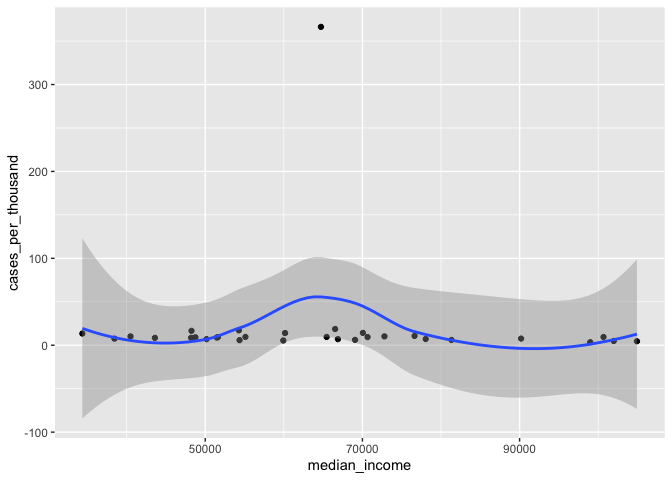
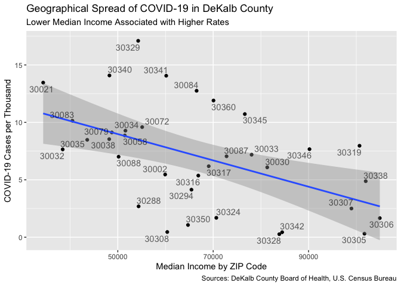

DeKalb County by Zipcode Methodology
================

July 9, 2020

``` r
#Load required libraries

library(tidyverse)
```

    ## ── Attaching packages ─────────────────────────────────────────────────────────────────────────────── tidyverse 1.3.0 ──

    ## ✓ ggplot2 3.3.1     ✓ purrr   0.3.4
    ## ✓ tibble  3.0.1     ✓ dplyr   1.0.0
    ## ✓ tidyr   1.1.0     ✓ stringr 1.4.0
    ## ✓ readr   1.3.1     ✓ forcats 0.5.0

    ## ── Conflicts ────────────────────────────────────────────────────────────────────────────────── tidyverse_conflicts() ──
    ## x dplyr::filter() masks stats::filter()
    ## x dplyr::lag()    masks stats::lag()

``` r
library(modelr)
library(ggrepel)
```

The [DeKalb County Board of
Health](https://www.dekalbhealth.net/covid-19dekalb/) has released data
on local COVID-19 cases, sorted by ZIP Code. This information has not
been shared in a format that is suitable for data analysis, so I
copied-and-pasted the raw numbers into a text file, which I then
imported and tidied.

``` r
#Import and tidy data from DeKalb County Board of Health 
#https://www.dekalbhealth.net/covid-19dekalb/

dekalb <- read_lines("Dekalb.txt", skip_empty_rows = TRUE)
dekalb <- dekalb[dekalb != "\t"]
dekalb <- dekalb[6:(length(dekalb))]
dekalb <- matrix(dekalb, ncol = 5, byrow = TRUE) %>%
  as_tibble(.name_repair = "unique") %>%
  select(...1, ...3) %>%
  rename(ZIP = ...1,
         current_count = ...3,)
```

    ## New names:
    ## * `` -> ...1
    ## * `` -> ...2
    ## * `` -> ...3
    ## * `` -> ...4
    ## * `` -> ...5

The U.S. Census Bureau’s most recent American Community Survey 5-year
estimate, released in 2018, provides estimates at the ZIP Code level (or
rather ZCTA) for a variety of statistics on the U.S. population. The
2010 Census provides population counts for each ZCTA, information we
need to calculate cases per capita.

``` r
#Import data from US Census American Community Survey 2018 5-year estimate

zcta <-
  read_csv("ACSST5Y2018.S1901_data_with_overlays_2020-07-04T190723.csv",
           skip = 1, na = "null") %>%
  mutate(ZIP = str_extract(`Geographic Area Name`,
                           ".....$")) %>%
  select(ZIP, `Estimate!!Households!!Median income (dollars)`)
```

    ## Parsed with column specification:
    ## cols(
    ##   .default = col_character(),
    ##   `Estimate!!Households!!Total` = col_double(),
    ##   `Margin of Error!!Households MOE!!Total` = col_double(),
    ##   `Estimate!!Families!!Total` = col_double(),
    ##   `Margin of Error!!Families MOE!!Total` = col_double(),
    ##   `Estimate!!Married-couple families!!Total` = col_double(),
    ##   `Margin of Error!!Married-couple families MOE!!Total` = col_double(),
    ##   `Estimate!!Nonfamily households!!Total` = col_double(),
    ##   `Margin of Error!!Nonfamily households MOE!!Total` = col_double()
    ## )

    ## See spec(...) for full column specifications.

``` r
#Import population data from 2010 Census. I originally used data for the entire 
#ZCTA, but this doesn't work because some of these ZCTAs do not fall entirely 
#within DeKalb. We need to figure out how many people live in DeKalb, not in the 
#ZCTA as a whole. Fortunately the Census Bureau provides a file that specifies 
#the relation between ZCTAs and counties, and this document gives us the numbers 
#we need.  

zcta_pop <- read_csv("zcta_county_rel_10.txt") %>%
  filter(STATE == "13" & COUNTY == "089") %>%
  select(ZIP = ZCTA5, total_population = POPPT)
```

    ## Parsed with column specification:
    ## cols(
    ##   .default = col_double(),
    ##   ZCTA5 = col_character(),
    ##   COUNTY = col_character()
    ## )
    ## See spec(...) for full column specifications.

Now that we have the data from the county Board of Health and the Census
Bureau, we can combine them into a single data frame and calculate cases
per thousand population.

``` r
#Join ACS data with local COVID-19 data and specify column types

dekalb <- dekalb %>%
  inner_join(zcta) %>%
  mutate(
    current_count = as.numeric(current_count),
    median_income = as.numeric(`Estimate!!Households!!Median income (dollars)`)
  ) %>%
  select(!(`Estimate!!Households!!Median income (dollars)`))
```

    ## Joining, by = "ZIP"

``` r
#Add population data to Dekalb tibble and calculate per capita data

dekalb <- dekalb %>%
  inner_join(zcta_pop) %>%
  mutate(cases_per_thousand = current_count / (total_population / 1000)) %>%
  #something weird is going in with 30350. Let's exclude it
  filter(ZIP != "30350")
```

    ## Joining, by = "ZIP"

``` r
#clear redundant tibbles from memory

remove(zcta)
remove(zcta_pop)
```

Now that these data have been tidied, combined, and calculated, we can
take a look and see if there’s a pattern.

``` r
#Now let's make a plot to see if there is a correlation between income and disease

ggplot(data = dekalb,
       mapping = aes(median_income, cases_per_thousand)) +
  geom_point() +
  geom_smooth()
```

    ## `geom_smooth()` using method = 'loess' and formula 'y ~ x'

<!-- -->

Before I corrected the data to account for ZCTAs not falling entirely
within the county, it seemed like there was a correlation between median
income and COVID-19, but I made the adjustments and I looked like I was
wrong. However, when I exclude a single ZIP Code that looks like there’s
something funny about it (30350), there does seem to be something of a
pattern, even if it’s much weaker than I had originally thought. Let’s
go ahead and fit the data to a linear model anyway.

``` r
#It looks like there's a correlation. Let's try modeling it

mod_covid <- lm(cases_per_thousand ~ median_income, dekalb)
summary(mod_covid)
```

    ## 
    ## Call:
    ## lm(formula = cases_per_thousand ~ median_income, data = dekalb)
    ## 
    ## Residuals:
    ##    Min     1Q Median     3Q    Max 
    ## -4.304 -2.148 -1.141  1.736  9.435 
    ## 
    ## Coefficients:
    ##                 Estimate Std. Error t value Pr(>|t|)    
    ## (Intercept)    1.414e+01  2.277e+00   6.210 1.04e-06 ***
    ## median_income -7.352e-05  3.352e-05  -2.194   0.0367 *  
    ## ---
    ## Signif. codes:  0 '***' 0.001 '**' 0.01 '*' 0.05 '.' 0.1 ' ' 1
    ## 
    ## Residual standard error: 3.551 on 28 degrees of freedom
    ## Multiple R-squared:  0.1467, Adjusted R-squared:  0.1162 
    ## F-statistic: 4.813 on 1 and 28 DF,  p-value: 0.03672

So it looks like there’s a correlation, but it’s not as strong as I had
thought. Let’s go ahead and make a nice chart to communicate these
results.

``` r
#Now let's make a prettier plot to communicate these results

ggplot(data = dekalb,
       mapping = aes(median_income, cases_per_thousand)) +
  geom_point() +
  geom_smooth(mapping = aes(),
              method = "lm",
              formula = y ~ x) +
  geom_text_repel(aes(label = ZIP), alpha = .6) +
  labs(title = "Geographical Spread of COVID-19 in DeKalb County",
       subtitle = "Lower Median Income Associated with Higher Rates",
       caption = "Sources: DeKalb County Board of Health, U.S. Census Bureau",
       x = "Median Income by ZIP Code",
       y = "COVID-19 Cases per Thousand"
  )
```

<!-- -->
