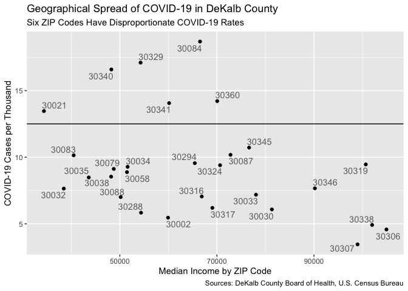
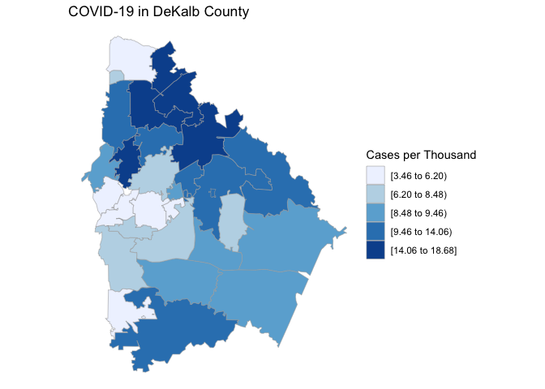

DeKalb County by Zipcode
================

July 9, 2020

``` r
#Load required libraries

library(tidyverse)
```

    ## ── Attaching packages ─────────────────────────────────────────────────────────────────────────────── tidyverse 1.3.0 ──

    ## ✓ ggplot2 3.3.2     ✓ purrr   0.3.4
    ## ✓ tibble  3.0.2     ✓ dplyr   1.0.0
    ## ✓ tidyr   1.1.0     ✓ stringr 1.4.0
    ## ✓ readr   1.3.1     ✓ forcats 0.5.0

    ## ── Conflicts ────────────────────────────────────────────────────────────────────────────────── tidyverse_conflicts() ──
    ## x dplyr::filter() masks stats::filter()
    ## x dplyr::lag()    masks stats::lag()

``` r
library(modelr)
library(ggrepel)
library(choroplethr)
```

    ## Loading required package: acs

    ## Loading required package: XML

    ## 
    ## Attaching package: 'acs'

    ## The following object is masked from 'package:dplyr':
    ## 
    ##     combine

    ## The following object is masked from 'package:base':
    ## 
    ##     apply

``` r
library(choroplethrZip)
data(zip.regions)
```

The [DeKalb County Board of
Health](https://www.dekalbhealth.net/covid-19dekalb/) has released data
on local COVID-19 cases, sorted by ZIP Code. This information has not
been shared in a format that is suitable for data analysis, so I
copied-and-pasted the raw numbers into a text file, which I then
imported and tidied.

``` r
#Import and tidy data from DeKalb County Board of Health 
#https://www.dekalbhealth.net/covid-19dekalb/

dekalb <- read_lines("Dekalb.txt", skip_empty_rows = TRUE)
dekalb <- dekalb[dekalb != "\t"]
dekalb <- dekalb[6:(length(dekalb))]
dekalb <- matrix(dekalb, ncol = 5, byrow = TRUE) %>%
  as_tibble(.name_repair = "unique") %>%
  select(...1, ...3) %>%
  rename(ZIP = ...1,
         current_count = ...3,)
```

    ## New names:
    ## * `` -> ...1
    ## * `` -> ...2
    ## * `` -> ...3
    ## * `` -> ...4
    ## * `` -> ...5

The U.S. Census Bureau’s most recent American Community Survey 5-year
estimate, released in 2018, provides estimates at the ZIP Code level (or
rather ZCTA) for a variety of statistics on the U.S. population. The
2010 Census provides population counts for each ZCTA, information we
need to calculate cases per capita.

``` r
#Import data from US Census American Community Survey 2018 5-year estimate

zcta <-
  read_csv("ACSST5Y2018.S1901_data_with_overlays_2020-07-04T190723.csv",
           skip = 1, na = "null") %>%
  mutate(ZIP = str_extract(`Geographic Area Name`,
                           ".....$")) %>%
  select(ZIP, `Estimate!!Households!!Median income (dollars)`)
```

    ## Parsed with column specification:
    ## cols(
    ##   .default = col_character(),
    ##   `Estimate!!Households!!Total` = col_double(),
    ##   `Margin of Error!!Households MOE!!Total` = col_double(),
    ##   `Estimate!!Families!!Total` = col_double(),
    ##   `Margin of Error!!Families MOE!!Total` = col_double(),
    ##   `Estimate!!Married-couple families!!Total` = col_double(),
    ##   `Margin of Error!!Married-couple families MOE!!Total` = col_double(),
    ##   `Estimate!!Nonfamily households!!Total` = col_double(),
    ##   `Margin of Error!!Nonfamily households MOE!!Total` = col_double()
    ## )

    ## See spec(...) for full column specifications.

``` r
#Import population data from 2010 Census. I originally used data for the entire 
#ZCTA, but this doesn't work because some of these ZCTAs do not fall entirely 
#within DeKalb. We need to figure out how many people live in DeKalb, not in the 
#ZCTA as a whole. Fortunately the Census Bureau provides a file that specifies 
#the relation between ZCTAs and counties, and this document gives us the numbers 
#we need.  

zcta_pop <- read_csv("zcta_county_rel_10.txt") %>%
  filter(STATE == "13" & COUNTY == "089") %>%
  select(ZIP = ZCTA5, total_population = POPPT)
```

    ## Parsed with column specification:
    ## cols(
    ##   .default = col_double(),
    ##   ZCTA5 = col_character(),
    ##   COUNTY = col_character()
    ## )
    ## See spec(...) for full column specifications.

Now that we have the data from the county Board of Health and the Census
Bureau, we can combine them into a single data frame and calculate cases
per thousand population.

``` r
#Join ACS data with local COVID-19 data and specify column types

dekalb <- dekalb %>%
  inner_join(zcta) %>%
  mutate(
    current_count = as.numeric(current_count),
    median_income = as.numeric(`Estimate!!Households!!Median income (dollars)`)
  ) %>%
  select(!(`Estimate!!Households!!Median income (dollars)`))
```

    ## Joining, by = "ZIP"

``` r
#Add population data to Dekalb tibble and calculate per capita data

dekalb <- dekalb %>%
  inner_join(zcta_pop) %>%
  mutate(cases_per_thousand = current_count / (total_population / 1000)) %>%
  #Something weird is going in with 30350. It's mostly in Fulton County, with 
  # only 101 people in DeKalb, but there's supposedly 37 positive cases there. 
  #Let's exclude try excluding ZIP Codes with populations of less than 1000.
  filter(total_population > 1000)
```

    ## Joining, by = "ZIP"

``` r
#clear redundant tibbles from memory

remove(zcta)
remove(zcta_pop)
```

Now that these data have been tidied, combined, and calculated, we can
take a look and see if there’s a pattern.

``` r
#Now let's make a plot to see if there is a correlation between income and disease

ggplot(data = dekalb,
       mapping = aes(median_income, cases_per_thousand)) +
  geom_point() +
  geom_smooth()
```

    ## `geom_smooth()` using method = 'loess' and formula 'y ~ x'

<!-- -->

Before I corrected the data to account for ZCTAs not falling entirely
within the county, it seemed like there was a correlation between median
income and COVID-19, but I made the adjustments and I looked like I was
wrong. However, when I exclude a single ZIP Code that looks like there’s
something funny about it (30350), there does seem to be something of a
pattern, even if it’s much weaker than I had originally thought. Looking
at the scatter plot, it seems like wealthier neighborhoods do tend to
have lower case rates, but there’s no distinction along the rest of the
distribution. Let’s go ahead and fit the data to a linear model anyway.

``` r
#It looks like there's a correlation. Let's try modeling it

mod_covid <- lm(cases_per_thousand ~ median_income, dekalb)
summary(mod_covid)
```

    ## 
    ## Call:
    ## lm(formula = cases_per_thousand ~ median_income, data = dekalb)
    ## 
    ## Residuals:
    ##    Min     1Q Median     3Q    Max 
    ## -4.327 -2.189 -1.227  1.818  9.418 
    ## 
    ## Coefficients:
    ##                 Estimate Std. Error t value Pr(>|t|)    
    ## (Intercept)    1.419e+01  2.342e+00   6.057 1.82e-06 ***
    ## median_income -7.399e-05  3.428e-05  -2.159   0.0399 *  
    ## ---
    ## Signif. codes:  0 '***' 0.001 '**' 0.01 '*' 0.05 '.' 0.1 ' ' 1
    ## 
    ## Residual standard error: 3.615 on 27 degrees of freedom
    ## Multiple R-squared:  0.1472, Adjusted R-squared:  0.1156 
    ## F-statistic: 4.659 on 1 and 27 DF,  p-value: 0.03994

``` r
#I wonder what happens if exclude wealthier ZIP Codes, say those with median 
#household incomes over $80,000

not_rich_dekalb <- dekalb %>%
  filter(median_income < 80000)

mod_covid <- lm(cases_per_thousand ~ median_income, not_rich_dekalb)
summary(mod_covid)
```

    ## 
    ## Call:
    ## lm(formula = cases_per_thousand ~ median_income, data = not_rich_dekalb)
    ## 
    ## Residuals:
    ##     Min      1Q  Median      3Q     Max 
    ## -4.7292 -2.7871 -0.9729  1.8699  8.5417 
    ## 
    ## Coefficients:
    ##                 Estimate Std. Error t value Pr(>|t|)  
    ## (Intercept)    1.063e+01  3.783e+00   2.811   0.0105 *
    ## median_income -7.430e-06  6.444e-05  -0.115   0.9093  
    ## ---
    ## Signif. codes:  0 '***' 0.001 '**' 0.01 '*' 0.05 '.' 0.1 ' ' 1
    ## 
    ## Residual standard error: 3.816 on 21 degrees of freedom
    ## Multiple R-squared:  0.0006327,  Adjusted R-squared:  -0.04696 
    ## F-statistic: 0.01329 on 1 and 21 DF,  p-value: 0.9093

Nothing significant going on there. It seems like the relevant
distinction here is between the wealthiest neighborhoods and everyone
else. Let’s create a group-wise model to express it mathematically.

``` r
dekalb <- mutate(dekalb, neighborhood_wealth = ifelse(median_income < 80000,
                 "not_rich", "rich"))
mod_covid_neighborhood <- lm(cases_per_thousand ~ neighborhood_wealth, data = dekalb)
summary(mod_covid_neighborhood)    
```

    ## 
    ## Call:
    ## lm(formula = cases_per_thousand ~ neighborhood_wealth, data = dekalb)
    ## 
    ## Residuals:
    ##     Min      1Q  Median      3Q     Max 
    ## -4.7480 -2.5631 -0.9299  1.6408  8.4739 
    ## 
    ## Coefficients:
    ##                         Estimate Std. Error t value Pr(>|t|)    
    ## (Intercept)              10.2078     0.7294  13.994 6.82e-14 ***
    ## neighborhood_wealthrich  -4.1825     1.6037  -2.608   0.0147 *  
    ## ---
    ## Signif. codes:  0 '***' 0.001 '**' 0.01 '*' 0.05 '.' 0.1 ' ' 1
    ## 
    ## Residual standard error: 3.498 on 27 degrees of freedom
    ## Multiple R-squared:  0.2012, Adjusted R-squared:  0.1716 
    ## F-statistic: 6.802 on 1 and 27 DF,  p-value: 0.01466

``` r
#Now let's make a prettier plot to communicate these results

ggplot(data = dekalb, mapping = aes(median_income, cases_per_thousand)) +
  geom_point() +
  geom_abline(slope = 0, intercept = 12.5) +
  geom_text_repel(aes(label = ZIP), alpha = .6) +
  labs(title = "Geographical Spread of COVID-19 in DeKalb County",
       subtitle = "Six ZIP Codes Have Disproportionate COVID-19 Rates",
       caption = "Sources: DeKalb County Board of Health, U.S. Census Bureau",
       x = "Median Income by ZIP Code",
       y = "COVID-19 Cases per Thousand"
  )
```

<!-- -->

When I look at this plot, it confirms that the wealthier neighborhoods
on average do have a lower incidence of COVID-19, but that largely seems
to be do to six non-wealthy ZIP Codes with unusually high levels: 30084,
30029, 30340, 30360, 30341, and 30021. Were they to be excluded, there
would not be much of a pattern among the rest. Let’s map them\!

``` r
dekalb_map <- dekalb %>%
  select("region" = ZIP, "value" = cases_per_thousand)
zip_choropleth(dekalb_map,
               zip_zoom = dekalb_map$region,
               title = "COVID-19 in DeKalb County",
               legend = "Cases per Thousand",
               num_colors = 5)
```

<!-- -->

So it’s pretty clear that the determining factor here is regional, with
the Northeast part of the county seeing higher rates of COVID-19\!
