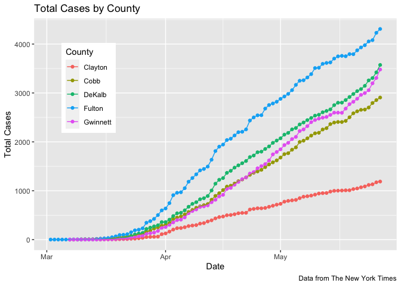
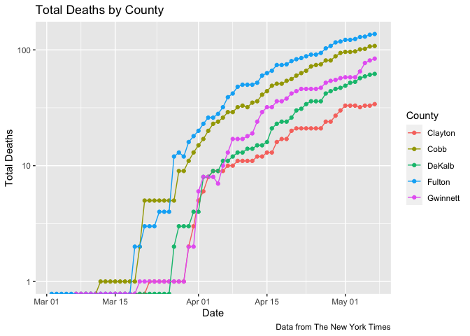
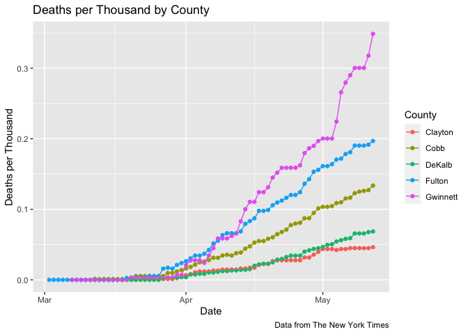
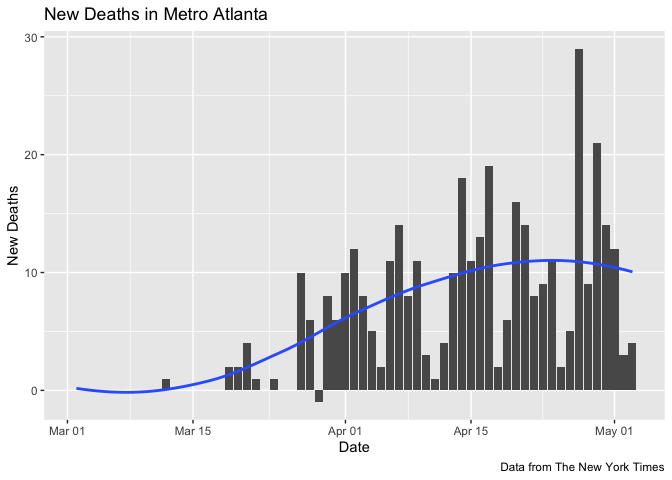
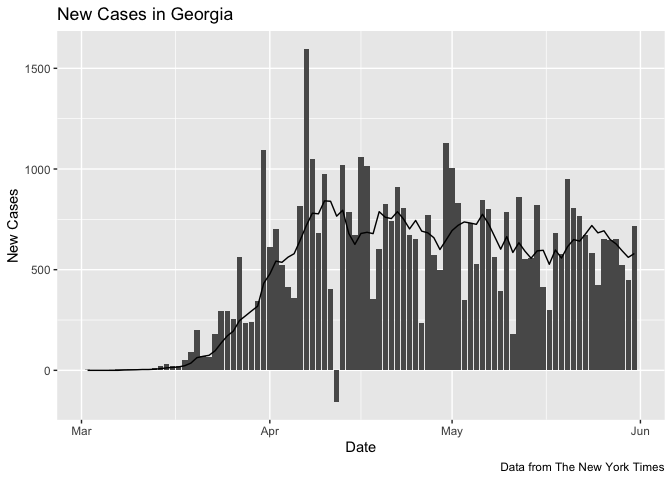
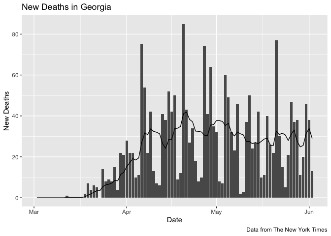
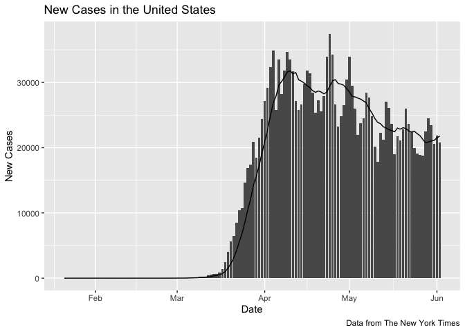
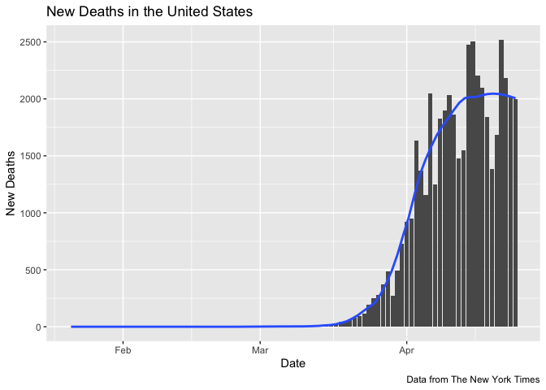

Metro Atlanta COVID
================

I wanted a better visualization of local Covid-19 data than I’ve been
able to find, particularly in terms of the distribution of cases and
deaths as they change over time. The charts below track confirmed cases
and deaths in the core Metro Atlanta counties, both in absolute and
relative terms. The subsequent charts track new cases and deaths in
Metro Atlanta, Georgia, and the United States.

All data come from the New York Times’ ongoing
[repository](https://github.com/nytimes/covid-19-data) of Covid-19 cases
and deaths in the United States.

It’s hard to know how to interpret these numbers since there are major
known unknowns. Neither confirmed cases nor deaths can be said to be
reliable counts of the true numbers.

Data current as of 27 April,
2020

# Metro Atlanta

# Georgia

# United States

